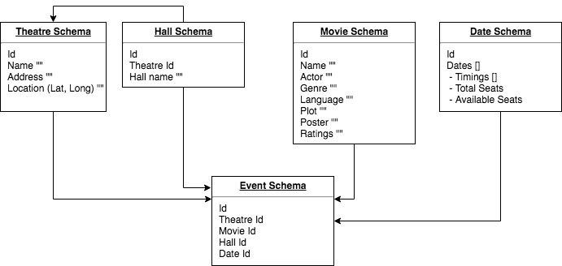

# Cinema experience App

### Data flow
Layering of concerns is a key here!
We've distributed the entire structure into three layers
- DB & Microservice Layer for handling data
- Node layer for API Augumentation & Page serving
- Client Application for showcasing and event triggering


### Database flow


### How to Run
1) Start mongo db with mongod
2) Start microservices by running ```npm run dev``` inside ```/_api```
3) Start application by running ```npm run dev``` under ```/_ssr```   


### Admin
Steps for adding and mapping theatres/movies/hall/dates/events
1. Add Movies and Theatres. [Here](./_admin/movie-theatre.html)
2. Map and create Hall List for Theatres. [Here](./_admin/hall.html) 
3. ADD Date for Movie (Select Movie -> Select Theatre -> Select Hall -> Add Dates). [Here](./_admin/date.html)    


### Microservice endpoint APIs

- Get All Movie    
`/api/v1/movie/filter`

- Get All Theatres   
`/api/v1/theatre/filter`

- Get Movies - based on theatre  
`/api/v1/movie/filter?theatre=<theatreId>`

- Search Movies - based on theatre  
`/api/v1/movie/filter?theatre=<theatreId>&search=<searchTerm>`

- Get Movies - based on theate and based on date (mm/dd/yyyy)   
`/api/v1/movie/filter?theatre=<theatreId>&searchdate=<searchDate>`

- Get Movies - based on theatre/date/timeStart/timeEnd  
`/api/v1/movie/filter?theatre=<theatreId>&searchdate=<searchDate>&timeStart=<Number>&timeEnd=<Number>`

- Get Dates/Movie Details - based on theatre  
`/api/v1/movie/filter?theatre=<theatreId>`
